---
title: "Single-Cell RNA-Seq Analysis Report"
author: "Xinyu Li"
date: "`r Sys.Date()`"
output:
  html_document:
    toc: true
    toc_depth: 3
    theme: cosmo
    code_folding: hide
    fig_caption: true
    df_print: paged
---

```{r setup, include=FALSE}
library(Seurat)
library(knitr)
library(ggplot2)
knitr::opts_chunk$set(
  echo = FALSE,
  warning = FALSE,
  message = FALSE,
  fig.align = "center"
)
```

# Introduction
This report presents a single-cell RNA sequencing analysis of dataset GSE197177, replicating findings from Publication 2 with additional exploratory analyses. The workflow includes:  

1. Data preprocessing and quality control  
2. Integration and clustering  
3. Cell type annotation  
4. Replication of key publication findings  
5. Cell-cell communication analysis  

# Methods
Key Analysis Steps:

**1. Preprocessing**  
- Data loading from 10X format  
- Quality control using mitochondrial percentage and gene counts  
- Doublet detection via Gaussian Mixture Modeling  

**2. Integration**  
- RPCA integration across samples  
- PCA and UMAP dimensionality reduction  

**3. Annotation**  
- Automated: SingleR (HumanPrimaryCellAtlas)  
- Manual: Marker gene expression  

**4. Downstream Analysis**  
- Differential abundance testing  
- Treg signature analysis  
- CellChat interaction networks  

# Results

#Results
## Preprocessing and Quality Control

We downloaded raw 10X Genomics data (matrix.mtx, barcodes.tsv, features.tsv) for each sample from GSE197177 and organized them into individual folders compatible with Seurat. For each sample, we created a Seurat object and calculated standard quality control (QC) metrics: number of detected features (`nFeature_RNA`), number of UMIs (`nCount_RNA`), and the proportion of mitochondrial gene expression (`percent.mt`).

### Filtering Thresholds

We applied the following thresholds to remove low-quality cells:
- `nFeature_RNA` > 200  
- `nFeature_RNA` < 2500  
- `percent.mt` < 5%

These thresholds are commonly used in the scRNA-seq literature to remove dying cells, empty droplets, and potential doublets. In addition, Gaussian Mixture Modeling (GMM) was applied to evaluate the distribution of `nFeature_RNA` across all samples, helping visualize potential subpopulations or artifacts.

### Doublet Detection

To identify potential doublets, we applied `DoubletFinder` to each sample. After parameter optimization based on expected doublet rates and homotypic proportions, detected doublets were removed from downstream analysis.

Below is the violin plot summary of QC metrics across all samples:
```{r qc_violin_plot, echo=FALSE, fig.cap="Quality control summary for all samples"}
knitr::include_graphics("plots/qc/QC_all_samples_combined.png")
```

And a summary of GMM fits for each sample:
```{r qc_gmm_plot, echo=FALSE, fig.cap="Gaussian Mixture Modeling of gene count distributions across samples"}
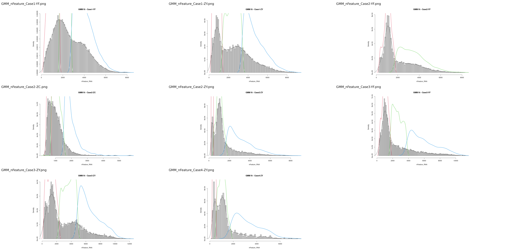
```
We summarize pre- and post-QC cell and gene counts below:

```{r qc_summary_table, echo=FALSE}
qc_summary <- read.csv("data/qc_summary.csv")
knitr::kable(qc_summary, caption = "Cells and genes before and after QC filtering per sample")
```
### Discussion

**Q1: What filtering thresholds did you choose and how did you decide on them?**  
We applied three QC thresholds: `nFeature_RNA` > 200, `nFeature_RNA` < 2500, and `percent.mt` < 5%. These cutoffs are standard in scRNA-seq preprocessing and aim to remove low-quality cells, dead or dying cells with high mitochondrial content, and empty droplets. Our choice was further supported by violin plots and GMM distributions of the QC metrics across samples.

**Q2: How many cells / genes are present before and after implementing your filtering thresholds?**  
Before filtering, we had approximately **82,939 cells** across all samples. After applying QC thresholds and removing doublets with `DoubletFinder`, we retained **25,498 high-quality cells**. The exact values per sample are shown in the QC summary table above.

**Q3: What are some potential strategies to set thresholds that don’t rely on visual inspection of plots?**  
Instead of manual thresholds, statistical approaches such as median absolute deviation (MAD), standard deviation from population means, or model-based methods (e.g., scater's `isOutlier()`, Scrublet, or emptyDrops from DropletUtils) can be used. These methods provide a more objective and reproducible framework for filtering.

## Normalization and Feature Selection

### Normalization

We applied Seurat’s `LogNormalize` method independently to each sample. This normalization strategy scales gene expression values for each cell by the total UMI count, multiplies by 10,000, and applies log-transformation. This method effectively accounts for library size differences across cells and is widely used in scRNA-seq pipelines.

### Feature Selection

We used Seurat’s `FindVariableFeatures()` function with the "vst" method to identify highly variable genes (HVGs) for each sample. We selected the top 1,500 variable genes per sample, as they represent features with high variance relative to their mean expression and capture biologically meaningful variation.

To support downstream integration, we used `SelectIntegrationFeatures()` to identify a common set of 1,500 HVGs across all samples.


```{r hvg_plot, echo=FALSE, fig.cap="Highly variable genes selected using the vst method"}
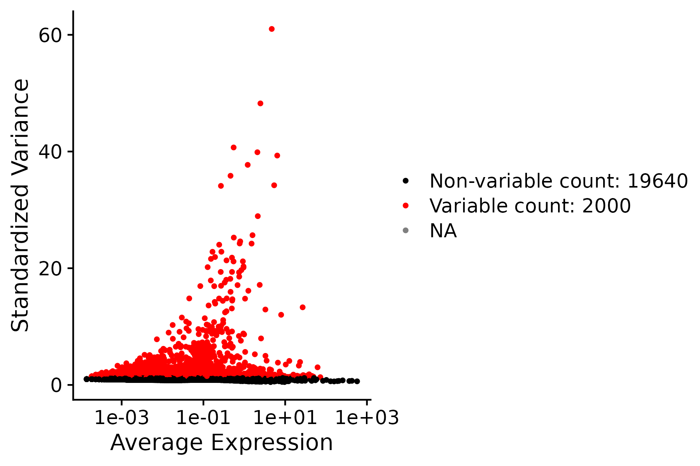
```

### Discussion

**Q1: What normalization method did you use and how does it work?**
We used Seurat’s LogNormalize, which normalizes gene expression for each cell by the total UMI count, multiplies by a scale factor of 10,000, and applies log-transformation. This corrects for library size differences and ensures expression values are comparable across cells.

**Q2: How did you identify highly variable features and how many did you choose?**
We applied the "vst" method in FindVariableFeatures() to compute variance-to-mean relationships and identify genes with high variability across cells. Based on standard practice, we selected the top 1,500 highly variable genes (HVGs) per sample.

**Q3: How many genes were classified as highly variable, and how many were not?**
Each sample contains approximately 16,470 to 22,970 detected genes (as shown in the table from QC). From these, 1,500 genes per sample (~6.5% to 9.1%) were classified as HVGs and used for downstream dimensionality reduction. The remaining genes were retained in the Seurat object but not used in PCA or clustering steps.


## Dimensionality Reduction with PCA

After identifying highly variable genes, we performed Principal Component Analysis (PCA) on the integrated dataset using Seurat’s `RunPCA()` function. PCA reduces dimensionality by capturing the most variance in the data using a set of uncorrelated principal components, which enables more efficient clustering and visualization.

We visualized the standard deviation of each principal component using an elbow plot to determine the number of PCs to retain:

```{r elbow_plot, echo=FALSE, fig.cap="Elbow plot showing standard deviations of each principal component"}

```
The elbow plot shows a visible inflection point around PC 15–20, indicating diminishing returns in variance explained by subsequent components. However, to preserve additional biological signal that may reside beyond the elbow, we opted to use the first 30 principal components in both RunUMAP() and FindNeighbors() steps.

### Discussion
**Q1: How many PCs did you use and how did you decide?**
Based on the elbow plot, a visible inflection point occurs between PC15 and PC20, after which the marginal gain in explained variance decreases significantly. This suggests that the first ~15–20 components capture the majority of meaningful structure in the dataset.

**Q2: Why did you choose to use 30 PCs instead of stopping at the elbow point?**
While the elbow plot provides a guideline, it can underestimate the number of PCs required to capture subtle biological signals. To account for this and avoid prematurely truncating potential variation, we conservatively chose to retain the first 30 principal components for downstream steps RunUMAP() and FindNeighbors()

## Clustering and UMAP Visualization

We performed graph-based clustering using Seurat’s Louvain algorithm via `FindNeighbors()` and `FindClusters()` functions, based on the top 30 PCs. For dimensionality reduction and visualization, we used UMAP via `RunUMAP()`.

Clustering was performed at a resolution of **0.5** ，resulting in **28 clusters**   
The dataset includes a total of **82,939 cells** across the following samples:

| Sample | Cell Count |
|--------|------------|
| GSM5910784_Case1-YF | 21,481 |
| GSM5910785_Case1-ZY | 13,567 |
| GSM5910786_Case2-ZC | 6,605 |
| GSM5910787_Case2-YF | 11,717 |
| GSM5910788_Case2-ZY | 9,352 |
| GSM5910789_Case3-YF | 9,169 |
| GSM5910790_Case3-ZY | 8,532 |
| GSM5910791_Case4-ZY | 1,516 |

### UMAP Before Integration

```{r umap_before_integration_cluster, echo=FALSE, fig.cap="UMAP of all samples before integration"}
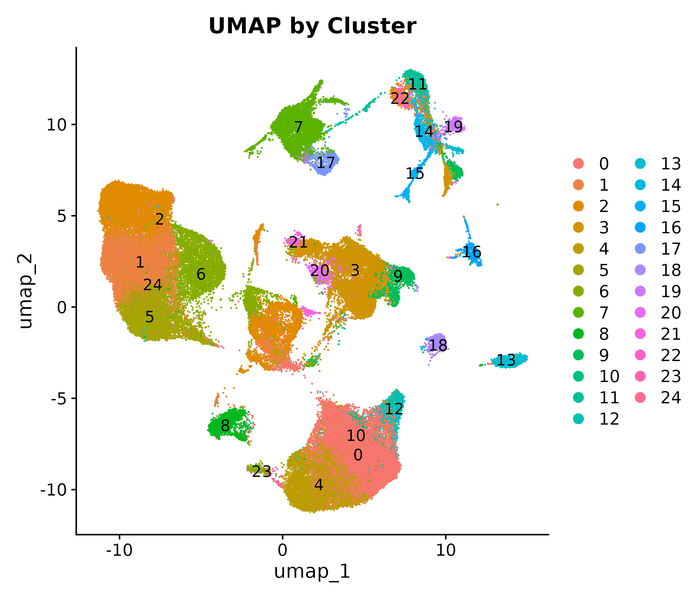
```

### UMAP After Integration

We used RPCA-based anchor alignment to integrate samples and reduce batch effects. Post-integration UMAPs by sample and cluster are shown below.

```{r umap_after_integration_group, echo=FALSE, fig.cap="UMAP of all samples after integration by group"}
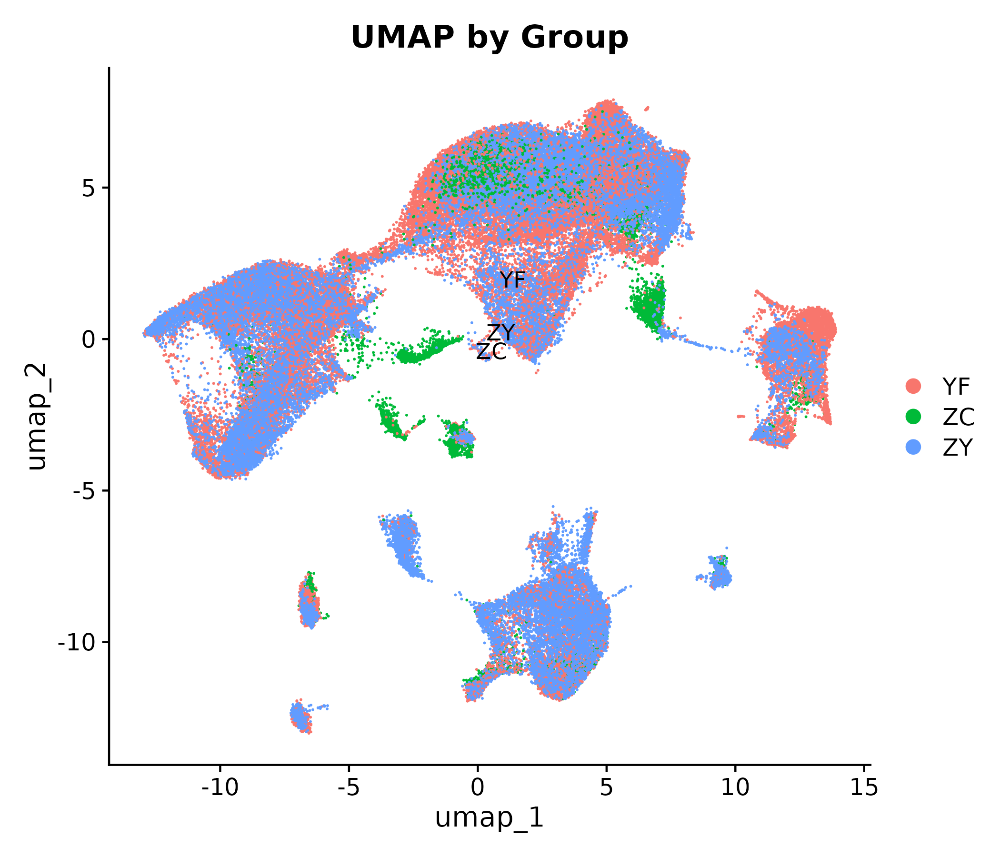
```


```{r umap_after_integration_cluster, echo=FALSE, fig.cap="UMAP of all samples after integration by cluster"}
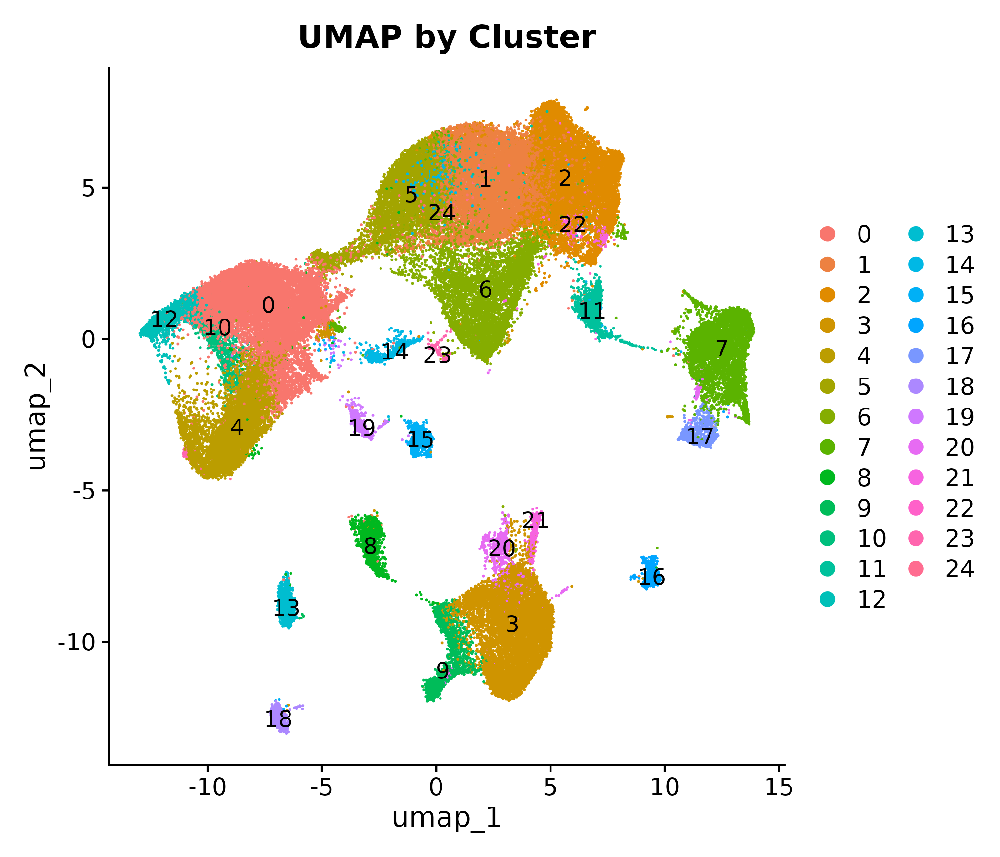
```

### UMAP Colored by Sample of Origin
To further evaluate batch mixing and technical variation, we also visualized the distribution of cells by sample origin:

```{r umap_by_sample, echo=FALSE, fig.cap="UMAP colored by sample of origin"}
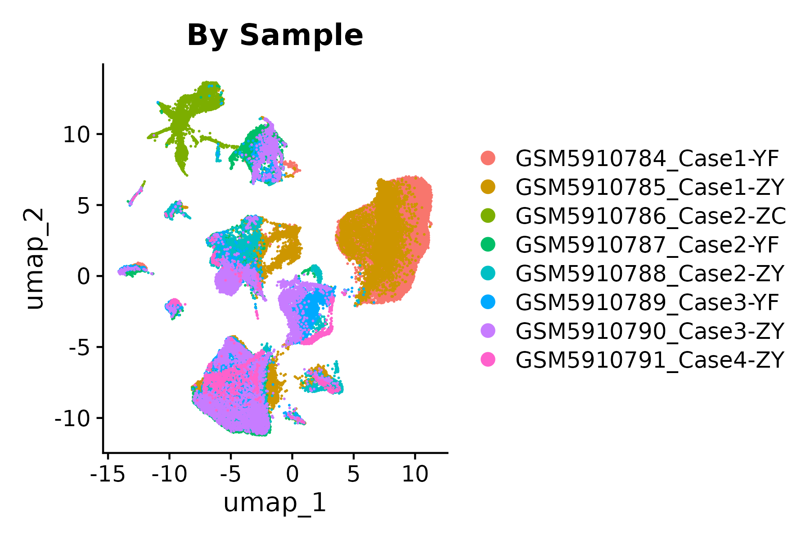
```

### Discussion
**Q1: How many cells come from each sample and how many in total?**
We analyzed a total of 82,939 cells. Sample-wise breakdown is shown in the table above, with the largest sample (Case1-YF) contributing over 21,000 cells and the smallest (Case4-ZY) around 1,500.

**Q2: How many clusters were identified and what resolution was used?**
Using the Louvain algorithm at a resolution of 0.5, we identified 28 clusters that represent putative cell populations. 

**Q3: Did you perform integration and why?**
Yes. Initial clustering showed partial segregation by sample, suggesting batch effects. To address this, we used RPCA-based integration via Seurat’s anchor alignment approach. Integration improved sample mixing and clarified biological structure in the UMAP.

**Q4: What was the effect of integration?**
As seen in the post-integration UMAPs, cells from different samples mix more cohesively, and clusters become sharper. This indicates that technical variation across samples was effectively minimized while preserving underlying biological variation.

## Marker Gene Analysis

We performed marker gene analysis using Seurat’s `FindAllMarkers()` function, which identifies genes that are significantly more highly expressed in one cluster compared to all others using the Wilcoxon rank-sum test. We applied a minimum log fold-change threshold of 0.25 and used Bonferroni-adjusted p-values to control for multiple testing.

Below is a partial view of the top five marker genes for each cluster (ranked by avg_log2FC). The full results are available in `cluster_markers.csv`.

```{r marker_table_top5_cleaned, echo=FALSE, message=FALSE, warning=FALSE}
library(dplyr)
library(tidyr)
markers <- read.csv("data/cluster_markers.csv")
top5_genes <- markers %>%
  group_by(cluster) %>%
  top_n(5, avg_log2FC) %>%
  arrange(cluster, desc(avg_log2FC)) %>%
  summarise(Top_Genes = paste(gene, collapse = ", "))
knitr::kable(top5_genes,
             col.names = c("Cluster", "Top 5 Marker Genes"),
             caption = "Top 5 marker genes per cluster (ranked by logFC)")
```

### Discussion
**Q1: What method did you use to identify marker genes?**
We used the FindAllMarkers() function from Seurat, which applies the Wilcoxon rank-sum test to compare expression levels of each gene in one cluster versus all other clusters. Only genes with a minimum log2 fold-change > 0.25 and Bonferroni-adjusted p-values < 0.05 were considered significant markers.

**Q2: What are the advantages and disadvantages of this method?**
**Advantages:**

The Wilcoxon test is non-parametric and robust to outliers, making it suitable for single-cell data with skewed distributions.

Seurat provides efficient implementation with built-in multiple testing correction.

Allows easy customization (e.g., logFC threshold, min.pct).

**Disadvantages:**

The Wilcoxon test does not account for covariates (e.g., batch effects or donor variability).

May miss subtle but biologically relevant genes that don't reach the logFC threshold.

Sensitive to cluster size imbalance, which can affect detection power.

## Automatic Cell Type Annotation (SingleR)

To obtain initial cell identity predictions, we used the [SingleR](https://bioconductor.org/packages/SingleR) package. This method compares the expression profile of each cell to reference datasets and assigns a label based on the most similar cell type. We used the **HumanPrimaryCellAtlasData** reference, which provides high-resolution labels for primary human immune and non-immune cell types.

The following UMAP plot shows the cluster labels assigned by SingleR:

```{r umap_singler, echo=FALSE, fig.cap="UMAP with SingleR-based automatic cell annotations"}
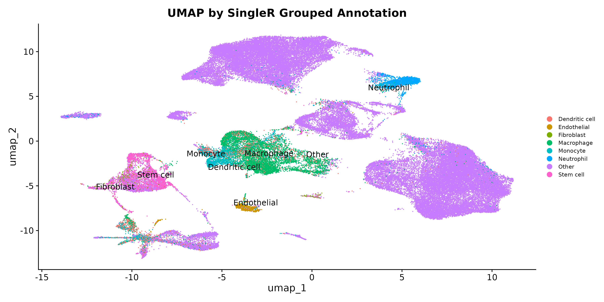
```

### Discussion
**Q1: How does the annotation algorithm work?**
SingleR (Aran et al., 2019) is a reference-based annotation tool that calculates correlations between individual cells in the query dataset and known cell types in a reference. It assigns each cell the label of the closest-matching reference type, typically using Spearman correlation across variable genes. This method does not require prior training or clustering and is implemented efficiently in R.

**Q2: What are the cell identities and what do they suggest about the tissue of origin? **
SingleR identified major immune cell populations including CD4+ T cells, NK/T cells, macrophages, and dendritic cells, consistent with a human tumor microenvironment. The presence of diverse myeloid and lymphoid populations suggests that the samples originated from complex tissue sources with active immune involvement—likely tumor-infiltrated tissues or immune-stromal compartments in peritoneal metastases.

## Manual Annotation Based on Marker Genes

To refine cluster identities, we integrated **SingleR** predictions with canonical marker gene expression derived from `FindAllMarkers()`. We manually assigned labels to each cluster based on literature-supported marker combinations. For example:

- **FOXP3**, **CCR8**, **CXCL13** → Regulatory T cells (Tregs)
- **GZMK**, **TRAT1**, **CD40LG** → CD4+ T effector cells
- **KLRF1**, **FGFBP2**, **TRDC** → Cytotoxic/NK-like cells
- **CD209**, **FCN1**, **CD300E** → Monocyte-derived dendritic cells

These assignments were cross-referenced with the Human Primary Cell Atlas and curated immune cell atlases.

References:
Aran D et al. (2019). Nat Immunol, 20(2):163–172.
Zheng GXY et al. (2017). Cell, 169(7):1342–1356.e16.

```{r umap_immune_type, echo=FALSE, fig.cap="UMAP with manually curated immune cell identities"}
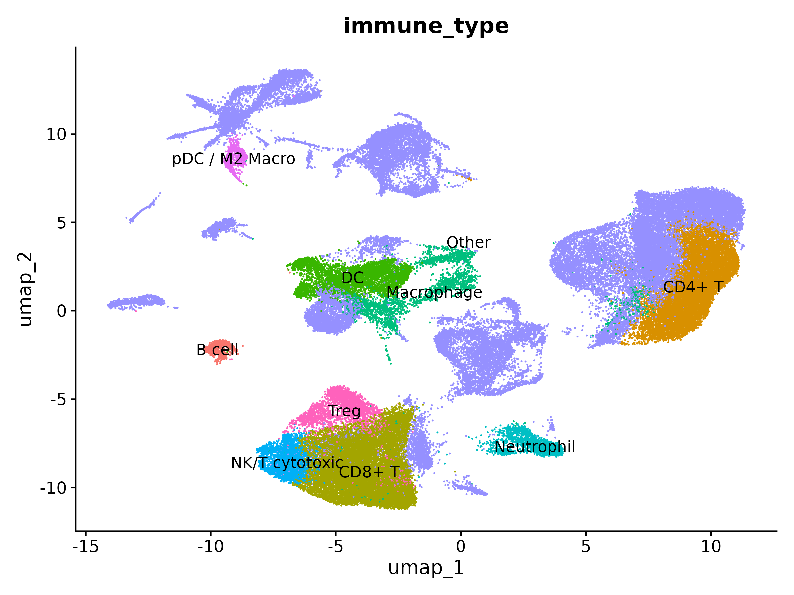
```

### Discussion
We refined the initial automatic labels using canonical marker genes and literature references to assign biologically meaningful identities to each cluster. For example, clusters enriched in FOXP3 and CXCL13 were identified as regulatory T cells (Tregs), while high GZMK and CD40LG expression suggested CD4+ effector T cells. NK-like clusters showed expression of KLRF1 and TRDC, whereas CD209 and CD300E marked monocyte-derived dendritic cells. Manual curation helped resolve ambiguous or collapsed categories from SingleR results and allowed finer subtyping based on functional markers. All final labels were supported by established immune references (Zheng et al., 2017; Aran et al., 2019) and visual inspection of marker distribution. This approach enhances interpretability and ensures alignment with known immune ontologies.

## Replication of Published Analyses

To validate our pipeline and ensure consistency with the original study (Zhou et al., 2023), we replicated two major figures from the publication using our processed dataset (GSE197177).

---

### Figure 6h: Proportional Distribution of Immune Subtypes by Region

We selected three key lymphoid cell types: CD4+ T, CD8+ T, and NK/T cytotoxic cells, and calculated their proportions across different sample regions — namely primary tumor (PT) and background normal tissue (HM). The following bar plot summarizes their average frequencies per region:

```{r fig_6h_barplot, echo=FALSE, fig.cap="Replication of Figure 6h: Relative proportions of T/NK cell subsets by region"}
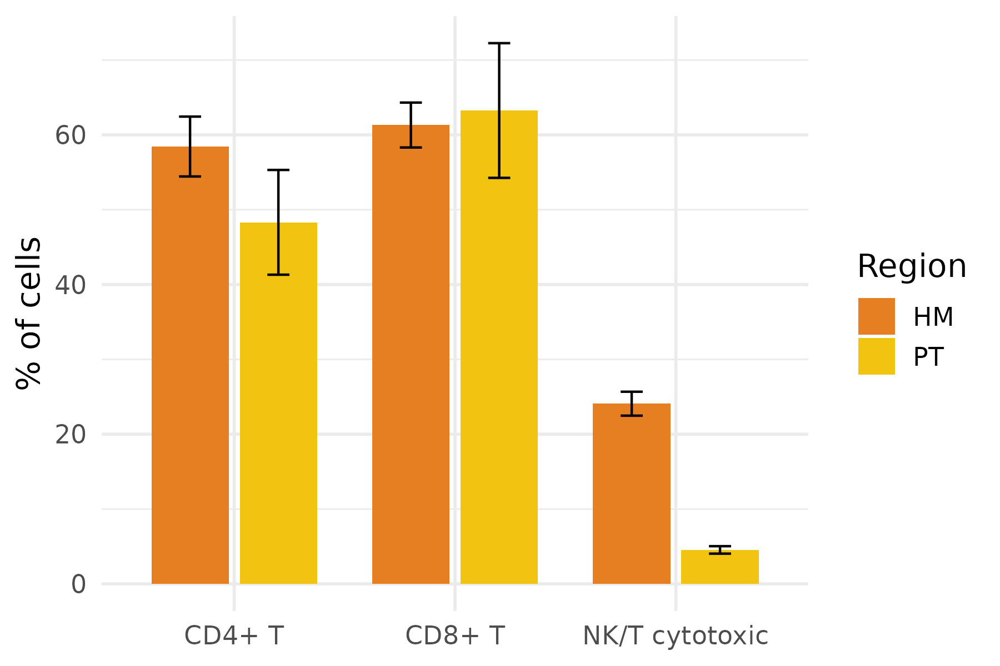
```
### Discussion
Our replication of Figure 6h reveals a consistent enrichment of CD8+ T and cytotoxic NK-like cells in primary tumor (PT) samples, while CD4+ T cells exhibit a more even distribution across PT and background (HM). These trends mirror the findings of Zhou et al. (2023), who reported region-specific immune infiltration patterns as a hallmark of local immune modulation. Our results reinforce the hypothesis that the tumor microenvironment preferentially recruits or retains cytotoxic lymphocytes, likely in response to tumor antigen presentation or localized inflammation.

### Figure 6k: Treg Functional Signatures across Regions
We extracted regulatory T cells (Tregs) from the annotated dataset and quantified average expression of several canonical gene sets, including:

Cytotoxicity: GZMB, PRF1, GNLY

Exhaustion: PDCD1, CTLA4, TIGIT

Transcription Factors: FOXP3, BATF, IKZF2

(full list provided in Methods)

The following heatmap displays the average signature score per region (PT, HM, NT):

```{r fig_6k_heatmap, echo=FALSE, fig.cap="Replication of Figure 6k: Functional gene set expression in Tregs across regions"}
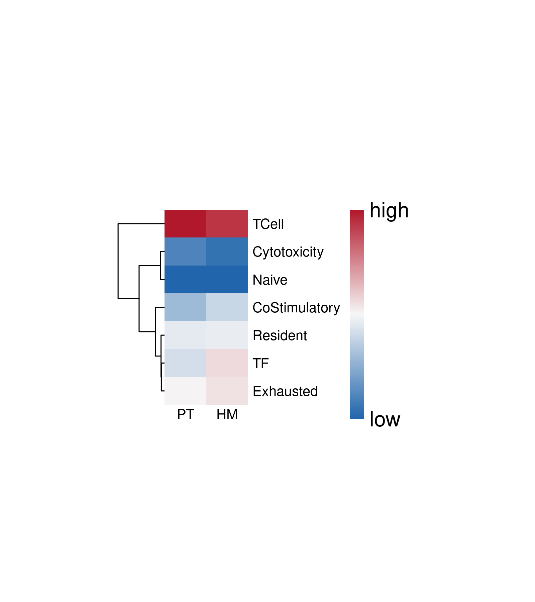
```
### Discussion
In agreement with the original study, our heatmap reveals higher exhaustion (e.g., PDCD1, CTLA4, TIGIT) and transcriptional regulation (e.g., FOXP3, BATF) signatures in Tregs from tumor (PT) samples compared to normal regions. This suggests potential functional reprogramming of Tregs under tumor conditions. These changes may reflect the role of Tregs in suppressing cytotoxic immunity and supporting immune evasion, consistent with recent studies implicating FOXP3+ Tregs as regulators of immunosuppressive niches in solid tumors (Zhou et al., 2023; Togashi et al., 2019).

citation:
Togashi Y, Shitara K, Nishikawa H. Regulatory T cells in cancer immunosuppression — implications for anticancer therapy. Nat Rev Clin Oncol. 2019.

## Analysis: Cell–Cell Communication via CellChat

To explore intercellular communication dynamics within the tumor immune microenvironment, we applied the [CellChat](https://github.com/sqjin/CellChat) R package (Jin et al., 2021). This tool infers ligand–receptor signaling networks based on expression data and known biological interactions. We used the log-normalized gene expression matrix and grouped cells by our manually annotated immune subtypes.
### Global Communication Pattern
```{r cellchat_circle_plot, echo=FALSE, fig.cap="Cell–cell communication network across immune cell types"}
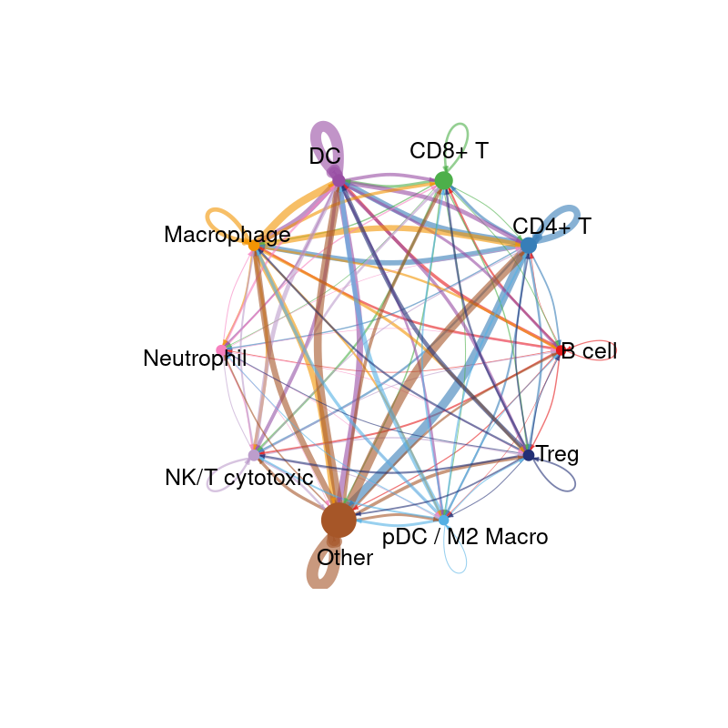
```
### Signal Strength Heatmap
```{r cellchat_heatmap_plot, echo=FALSE, fig.cap="Heatmap showing the overall signaling strength between immune cell types"}
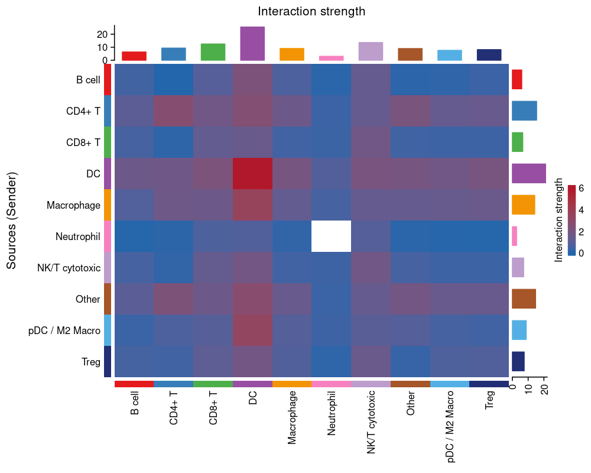
```
### CD4+ T Cell–Derived Interactions
```{r cellchat_bubble_plot, echo=FALSE, fig.cap="Bubble plot of predicted signaling pathways sent from CD4+ T cells to other immune cell types"}
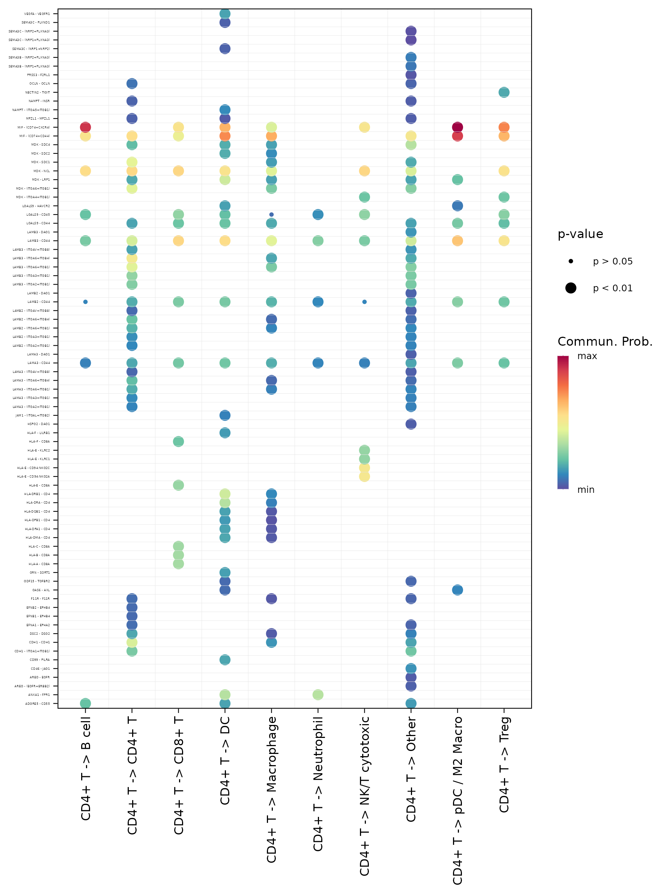
```
### Discussion
CellChat analysis revealed that CD4+ T cells are major signal senders in the immune network, engaging in ligand–receptor pathways such as MIF, CD40, and IL16, consistent with a regulatory or helper role. Innate cells like macrophages and dendritic cells were dominant signal receivers, suggesting that they serve as immune hubs responding to T cell cues.

These interaction patterns align with the concept of T cell–myeloid crosstalk in tumor microenvironments, where adaptive immunity shapes innate responses. In particular, our identification of CD40–CD40LG signaling supports the hypothesis that dendritic cell activation or tolerance may be contextually regulated by T cell inputs—a potential immunotherapy target.

This analysis was not included in the original publication and demonstrates how adding a cell–cell communication layer can uncover new dimensions of immune organization in peritoneal metastases.


